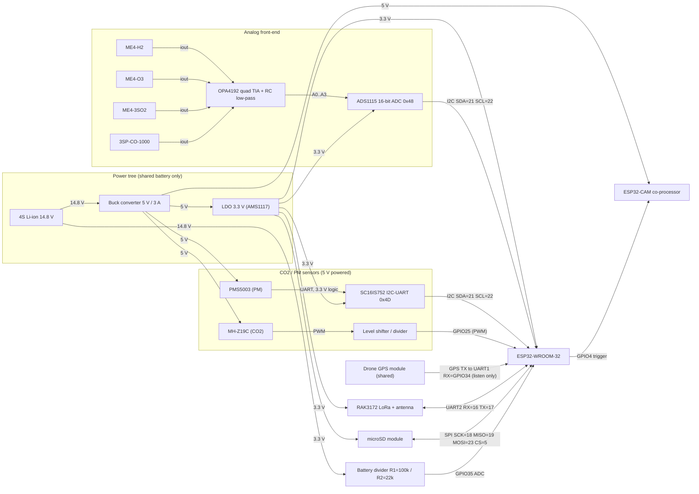

# Drone Monitoring Node — Wiring / Circuit Diagram

This diagram is the **as-coded** wiring: every pin here matches
[`include/config.h`](../include/config.h). If you rewire anything, update `config.h` (and vice-versa) so the firmware and
hardware stay in agreement.

Scope: the **monitoring payload only**. The propulsion chain (flight controller, ESCs, motors) is electrically
independent and shares nothing with this payload except the battery.

## Authoritative pin map (from `config.h`)

| Peripheral | ESP32 pin(s) | Bus / mode | Rail | Notes |
|---|---|---|---|---|
| ADS1115 ADC (4× gas TIA outputs) | SDA=**GPIO21**, SCL=**GPIO22** | I²C @ 0x48, 400 kHz | 3.3 V | 4.7 kΩ pull-ups on SDA/SCL |
| SC16IS752 I²C-UART bridge (for PMS5003) | SDA=**GPIO21**, SCL=**GPIO22** | I²C @ 0x4D | 3.3 V | shares I²C bus; 1.8432 MHz xtal |
| MH-Z19C CO₂ | **GPIO25** | PWM capture (input) | 5 V (sensor) | **level-shift PWM → 3.3 V** (GPIO25 not 5 V-tolerant) |
| GPS (drone's, shared) | RX=**GPIO34** | UART1, listen-only | 3.3 V | passive tap on GPS **TX**; ESP32 TX unconnected |
| RAK3172 LoRa | RX=**GPIO16**, TX=**GPIO17** | UART2 @ 115200 | 3.3 V | + antenna |
| microSD card | SCK=**18**, MISO=**19**, MOSI=**23**, CS=**5** | SPI (VSPI) | 3.3 V | FAT32 |
| ESP32-CAM trigger | **GPIO4** (output) | GPIO pulse | 5 V (cam) | co-processor; captures on pulse |
| Battery monitor | **GPIO35** (ADC1) | analog in | via divider | R1=100 k / R2=22 k → ÷5.545 |

## Diagram

## Wiring notes (important for it to actually work)

1. **Common ground.** All modules — including the 5 V devices, the ESP32-CAM, and the drone's GPS/flight-controller —
   must share a single **star ground** (tie grounds at the buck/PDB, not daisy-chained). Without a common ground the
   passive GPS tap and the analog front-end will read garbage.
2. **GPS passive tap (flight-controller-agnostic).** Connect **only** the GPS module's **TX** to `GPIO34`. Leave the
   ESP32's TX **unconnected** to the GPS so it can never contend with the flight controller, which owns the GPS. The
   firmware auto-detects baud and decodes NMEA or UBX.
3. **MH-Z19C PWM level.** `GPIO25` is not 5 V-tolerant. If the sensor's PWM high level exceeds 3.3 V, put a level
   shifter or a simple resistor divider on the PWM line (shown as *Level shifter / divider*).
4. **PMS5003.** Powered from 5 V, but its UART logic is 3.3 V, so it connects **directly** to the 3.3 V SC16IS752 with
   no level shifting on the data lines.
5. **I²C bus.** ADS1115 (0x48) and SC16IS752 (0x4D) share `GPIO21/22`; fit one pair of 4.7 kΩ pull-ups to 3.3 V. The
   SC16IS752 needs its own crystal (1.8432 MHz per `config.h`) and its address is set by the A0/A1 straps.
6. **Decoupling.** 0.1 µF at every IC, 10 µF per module, 100 µF at the buck output — matches the design's noise plan and
   keeps the electrochemical baselines stable during motor EMI.
7. **ESP32-CAM.** Runs from its own 5 V, shares ground, and is triggered by a pulse on `GPIO4`. It names captured images
   by the `(epoch, seq)` convention so no return data link (extra UART) is needed.
8. **Analog scaling.** Set the per-channel feedback resistor `Rf`, sensitivity, and ADS1115 PGA in `config.h`
   (`kGasRf`, `kGasSensAperPpm`, `kGasPga`) to the as-built values so the firmware converts volts → ppm correctly.
